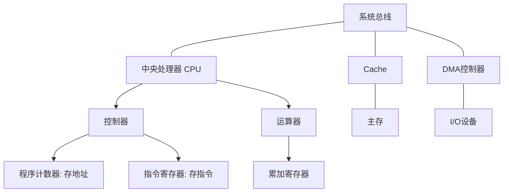

# 1.1 硬件知识

> 关联章节：[3.1 数据通信基础](part1/3.1-datacom.md) (涉及差错控制)

## 1. 计算机组成：CPU 的秘密
针对 PC 和 IR 的混淆，我们用“厨师做菜”来类比：
* **程序计数器 (PC, Program Counter)**：它是“菜谱的页码”。它指向下一道菜在哪一页，执行完当前指令后，它会自动加 1（或者跳转到目标地址）。**重点：它存的是地址。**
* **指令寄存器 (IR, Instruction Register)**：它是“当前正在炒的那道菜的菜名和做法”。CPU 把指令从内存取出来后，暂存在这里。**重点：它存的是指令内容。**

#### 常用寄存器分类表
| 寄存器名称 | 缩写 | 功能描述 | 考点分类 |
| :--- | :--- | :--- | :--- |
| **程序计数器** | **PC** | 存储下一条指令的**地址** | 控制器 |
| **指令寄存器** | **IR** | 存储当前正在执行的**指令**内容 | 控制器 |
| **累加寄存器** | **AC** | 暂时存放算术逻辑运算的操作数或结果 | 运算器 |
| **状态寄存器** | **PSW** | 存放运算过程中的标志位（进位、溢出等） | 运算器 |

## 2. 指令系统与处理器性能 (流水线)
为了提高 CPU 效率，现代处理器采用**流水线**技术。

* **原理**：将指令执行分为取指、分析、执行等阶段，让不同指令的各阶段重叠执行。
* **流水线周期**：各子阶段中最长的时间。
* **计算公式**：
    * **流水线执行 $n$ 条指令的时间**：$第一条指令执行时间 + (n - 1) \times 流水线周期$。
    *   **吞吐率 (TP)**：单位时间内执行的指令数。$TP = \frac{n}{流水线执行总时间}$。
    *   **最大吞吐率**：$\frac{1}{流水线周期}$。

## 3. 存储系统：层次化与编址

#### 3.1 高速缓存 (Cache)
* **目的**：提高 CPU 对主存的访问速度，利用**局部性原理**（时间/空间局部性）。
* **平均存取时间**（常考）：若 $t_c$ 为 Cache 命中访问时间、$t_m$ 为主存访问时间，则常用写法为 $T = h \times t_c + (1-h)\times(t_c+t_m)$。有些题目也会把“未命中时总时间”直接记作 $t_2$，此时可写成 $T = h\times t_1 + (1-h)\times t_2$（注意 $t_2$ 不一定等于单纯的主存周期）。

#### 3.2 内存编址计算 (常考)
* **地址单元数**：$末地址 - 首地址 + 1$。
* **单位换算**：$1024B = 1KB$；$2^{10} = 1024$。
*   **计算技巧**：
    *   十六进制减法后记得 $+1$。
    *   例如：$BFFFFH - 80000H + 1 = 40000H$。
    *   将结果转换为十进制：$4 \times 16^4 = 2^{2} \times (2^4)^4 = 2^{18}$。
    *   转换 $KB$：$2^{18} / 2^{10} = 2^8 = 256 KB$。

## 4. I/O 结构：中断、DMA 与 通道
* **中断方式**：设备准备好后通知 CPU，以字节为单位传输。
* **DMA (直接内存存取)**：数据在 I/O 和内存间直接传输，**不经过 CPU**，按数据块传输。仅在传输开始和结束阶段需要 CPU 介入。
* **通道**：具有独立处理器能力的 I/O 控制器，进一步减少 CPU 负担。

## 5. 差错控制与可靠性基础

#### 5.1 海明码 (Hamming Code)
用于检错和**纠错**（纠 1 位错）。
* **公式**：若数据位为 $n$ 位，校验位为 $k$ 位，则必须满足：$2^k \ge n + k + 1$。

#### 5.2 CRC 循环冗余校验
用于检错。利用**模2除法**计算校验码。

#### 5.3 可靠性计算
* **串联系统**：$R = R_1 \times R_2 \times \dots \times R_n$。
* **并联系统**：$R = 1 - (1 - R_1) \times (1 - R_2) \dots \times (1 - R_n)$。

## 6. 逻辑架构示意图

