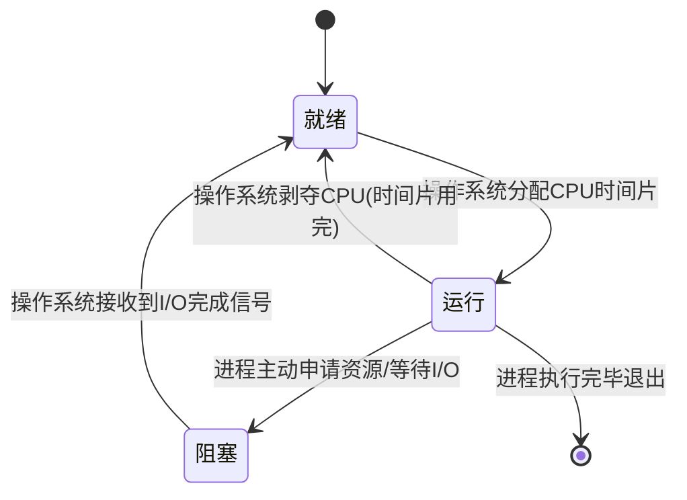

# 1.2 操作系统知识

操作系统（OS）是计算机系统的“管家”，负责管理硬件资源并为应用程序提供服务。

### 1.2.1 进程管理 (Process Management)

#### 1. 进程的状态转换：谁改变了谁？

进程在生命周期中并非静止，而是根据资源和 CPU 的分配情况不断切换状态。

* **运行 (Running)**：**进程** 占有着 CPU 资源，正在执行指令。
* **就绪 (Ready)**：**进程** 已做好一切准备，正在排队“等候” **操作系统调度程序** 分配 CPU。
* **阻塞 (Blocked)**：**进程** 因等待某事件（如 I/O 读写完成、申请信号量）而无法继续，即使 CPU 空闲也无法运行。

#### 2. PV 操作：资源竞争的仲裁

这里涉及三个主体：**执行进程**（申请/释放者）、**信号量 S**（资源计数器）、**操作系统内核**（裁判员）。

* **P(S) 操作（申请资源）**：
1. **当前运行进程** 主动执行 $S = S - 1$。
2. **操作系统** 检查结果：
* 若 **S < 0**：说明资源已枯竭。**操作系统** 立即将 **该进程** 踢出 CPU，投入阻塞队列。
* 若 **S ≥ 0**：资源充足。**操作系统** 准许 **该进程** 继续运行。

* **V(S) 操作（释放资源）**：
1. **当前运行进程** 任务结束，执行 $S = S + 1$。
2. **操作系统** 检查结果：
* 若 **S ≤ 0**：说明之前有人在排队（例如 S 从 -1 变为 0）。此时，**操作系统** 会从等待队列中唤醒 **排在第一位的阻塞进程**，将其送回就绪队列。
* 若 **S > 0**：说明当前没人排队，**操作系统** 无需额外动作。

#### 3. 死锁：极端的资源僵局

* **死锁边界计算**：假设有 $n$ 个 **进程**，每个需要 $k$ 个资源。
* **最大死锁状态**：**系统** 分配了 $n \times (k-1)$ 个资源。此时 **每个进程** 手里都刚好差一个资源，大家都在互相等待。
* **绝对安全状态（破局）**：**系统** 提供 $n \times (k-1) + 1$ 个资源。这多出的 **1 个资源** 必然让 **某个进程** 凑齐 $k$ 个，从而运行结束并释放资源，解救全家。

---

### 1.2.2 存储管理 (Storage Management)

#### 1. 分页存储：地址的“翻译”逻辑

分页是为了让内存分配更灵活。

* **逻辑地址**：由 **CPU/程序** 产生的地址，包含【页号】和【页内偏移】。
* **页表**：由 **操作系统** 维护的一张映射表。
* **MMU (硬件)**：真正的“翻译官”。
1. **MMU** 截取逻辑地址。
2. **MMU** 查 **页表**，将【页号】转换为【物理块号】。
3. **MMU** 保持【偏移量】不变，拼接出【物理地址】。

*   **进制转换技巧 (以 4KB 页面为例)**：
    *   $4KB = 2^{12} Byte$，在十六进制中，前 4 位（$2^4$）代表一个字符，因此 **后 3 位十六进制数** 对应页内偏移量。
    *   例如：逻辑地址 `2C25H`，后三位 `C25` 是偏移量，前面的 `2` 就是 **页号**。

#### 2. 页面置换算法：谁被踢出内存？

当内存满了，**操作系统** 必须选择一个“倒霉蛋”页移回硬盘。

* **FIFO (先进先出)**：**操作系统** 踢走在内存里待的时间最久的那一页。不考虑使用频率，可能导致 **Belady 异常**。
* **LRU (最近最少使用)**：**操作系统** 踢走最后一次访问时间距离现在最远的那一页。理论基础是 **时间局部性**，效率高。

---

### 1.2.3 磁盘管理与文件管理

#### 1. 磁盘调度 (SCAN 算法)

* **施动者**：**磁盘控制器**。
* **逻辑**：磁头像电梯一样，顺着一个方向移动，顺路处理所有磁道请求，直到这一头没有请求了再反向。

#### 2. 文件系统路径

* **绝对路径**：**用户** 从根目录 `/` 开始描述。
* **相对路径**：**用户** 从当前工作目录开始描述。

---

### 📝 核心考点练习题

1. **（单选）** 某系统有 3 个进程，每个进程需要 2 个资源。若 **操作系统** 仅提供 3 个资源，则系统（ ）。
A. 一定死锁  B. 可能死锁  C. 一定不死锁  D. 无法确定
* **解析**：C。$n(k-1)+1 = 3(2-1)+1 = 4$。噢不对，本题中 $n \times (k-1) = 3 \times 1 = 3$。所以 3 个资源是“最大死锁量”，**可能**死锁。若要“一定不”，需 4 个。

2. **（计算）** **CPU** 发出逻辑地址为 `2A35H`，页面大小为 $4KB$。若页表显示页号 `2` 对应块号 `F`，则物理地址为（ ）。
A. 2A35H  B. FA35H  C. F000H  D. 3A35H
* **解析**：B。$4KB$ 对应十六进制 3 位偏移量 `A35`。页号为 `2`。**MMU** 将 `2` 换成 `F`，拼接得到 `FA35H`。

3. **（判断）** 执行 V 操作后，如果 $S > 0$，**操作系统** 会唤醒阻塞队列中的进程。（ ）
* **解析**：×。$S > 0$ 说明当前没人排队，不需要唤醒。