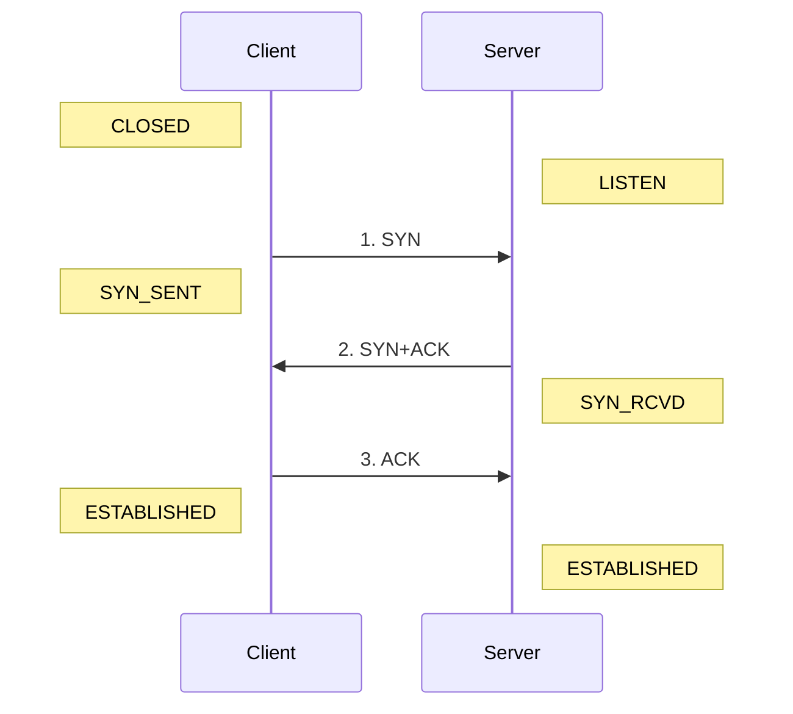

# 3.2 网络体系结构

> 本章是网络工程师中级考试中最核心的“骨架章节”，后续 VLAN、STP、OSPF、ACL、NAT、VPN 以及故障排查等所有内容都依赖本章理解，如果掌握透彻，后续学习难度可降低约 40%。

## 1. 为什么需要分层？

当我们在浏览器中输入网址访问网页时，数据会经历复杂的传输与处理过程。如果将所有功能混合实现，不仅协议修改会影响整个系统，还难以标准化。因此提出了**分层思想**，通过将复杂系统拆分为功能独立的模块，每一层只关注自身功能，通过标准接口与上下层通信，实现模块化、可维护性和可扩展性，就像软件开发中的表现层、业务层和数据层的分离一样。

分层原则核心包括：

1. 每层只负责自身功能  
2. 上层调用下层服务而不干涉内部实现  
3. 层与层之间通过接口通信  
4. 每层对外隐藏内部实现，保证模块解耦与可替换性  

考试提示：分层的目的在于降低复杂度，其优点包括标准化、模块化和可替换性，理解这一点是后续 VLAN、STP、OSPF 等模块化技术学习的基础。

## 2. OSI 七层模型与 TCP/IP 四层模型

下面以表格形式合并 OSI 七层模型与 TCP/IP 四层模型的功能、典型协议及考试提示，便于理解和记忆：

| OSI 层 | TCP/IP 层 | 功能 | 典型协议/案例 | 考试提示 |
|--------|-----------|------|---------------|-----------|
| 应用层 | 应用层 | 面向用户，提供最终应用服务 | HTTP、FTP、DNS、SMTP | 常考应用层协议功能 |
| 表示层 | 应用层 | 数据格式转换、加密、压缩 | TLS/SSL、JPEG/ASCII、压缩 | 记住“表示=格式/加密/压缩” |
| 会话层 | 应用层 | 建立、管理、终止会话 | 常由应用层/系统实现（如 RPC、NetBIOS 会话） | 了解功能与“并入应用层”的对应 |
| 传输层 | 传输层 | 端口号、可靠传输、流量控制 | TCP、UDP | TCP 三次握手是重点 |
| 网络层 | 网络层 | IP 地址管理、路由选择、分片 | IP、ICMP、OSPF、RIP、BGP | OSPF 链路状态协议，RIP 距离向量协议 |
| 数据链路层 | 网络接口层 | 成帧、MAC 地址、差错检测 | Ethernet、ARP、交换机 | VLAN、STP 工作层级 |
| 物理层 | 网络接口层 | 比特流传输、电压标准、接口规范 | 网线、光纤、RJ45 接口 | 不负责纠错，仅传输 0/1 |

> **真题陷阱**：ARP 常被描述为“网络层相关协议”，但它封装在二层帧中，用于在同一链路上把下一跳 IP 解析为 MAC，可视作二层/三层交界处的协议；注意“作用对象”和“封装所在层”的区别。

## 3. 数据封装过程

在发送数据时，每一层都会在数据上增加头信息，形成“封装”：

| 层级 | 封装内容 | 类比说明 |
|------|---------|---------|
| 传输层 | TCP/UDP 头 + 数据 | 快递单号 |
| 网络层 | IP 头 + TCP/UDP 头 + 数据 | 收件地址 |
| 数据链路层 | 帧头 + IP 头 + TCP/UDP 头 + 数据 + FCS | 小区门牌（含校验） |
| 物理层 | 比特流 | 快递车运输 |

考试关注点：

- 数据封装顺序  
- 哪层加端口号（传输层）  
- 哪层加 IP 地址（网络层）  
- 哪层加 MAC 地址（数据链路层）

## 4. TCP 三次握手

TCP 通过三次握手建立可靠连接：

|步骤|关键报文|状态变化|核心作用与逻辑|
|--|-------------|------------------|---------------------------|
|1|客户端发送SYN|客户端：CLOSED → SYN_SENT|客户端向服务端发起连接请求，并初始化序列号 $Seq=x$|
|2|服务端返回SYN+ACK|服务端：LISTEN → SYN_RCVD|服务端收到 SYN，同意连接；确认客户端序列号（$Ack=x+1$），并发送自己的初始序列号（$Seq=y$）|
|3|客户端返回ACK|双方进入：ESTABLISHED|客户端向服务端确认的序列号 ($Ack=y+1$)。服务端收到此包后，双方正式进入通信状态|

## 5. 考试重点：为什么两次握手（2-way handshake）不可行？
如果只采用两次握手，服务端在发送完 `SYN+ACK` 后就直接进入 `ESTABLISHED` 状态，会带来以下致命问题：
- 资源浪费（僵尸连接）：假设客户端发的第一个SYN在网络中由于拥塞滞留了。客户端超时重传了第二个SYN并完成了通信。此时，那个滞留的SYN突然到达服务端。如果是两次握手，服务端会立即建立一个新连接。但客户端此时并不需要这个连接，服务端会白白浪费CPU和内存资源（服务器会为建立的连接分配较多的资源并保持较长时间，keep-alive状态通常能保持数小时）。
- 序列号同步失败：第二次握手中，服务端发送了自己的序列号$Seq=y$。如果是两次握手，服务端无法确认客户端是否真的收到了这个$y$。如果该包丢失，客户端不知道从哪个序号开始接收数据，而服务端却以为连接已好，导致数据传输乱序或丢失。
- 减少半连接堆积（与抗攻击相关）：服务端必须看到第三次 `ACK` 才认为连接真正建立，否则只停留在 `SYN_RCVD`（半连接）状态；两次握手会让服务端更容易被伪造源 IP 的请求拖垮。

**💡 深度思考：**
序列号即验证码？
- 为什么服务端不能在第二次握手就进入 ESTABLISHED？因为第二次握手发送的序列号 $y$ 相当于服务端签发的“随机验证码”。在充满干扰和伪造的网络环境中，服务端必须通过第三次握手来确认：“对方是否真的收到了我发出的验证码？” 只有对方能准确报出 $y+1$，才能证明这不仅仅是一个虚假的 IP 请求，而是一个真实、存活、且正在与我对话的合法客户端。

## 6. 本章高频考点总结

1. OSI 七层顺序及功能
2. TCP/IP 四层结构及对应关系
3. ARP 协议的实际工作层
4. OSPF 协议类型及工作层
5. 数据封装顺序及各层头信息
6. TCP 三次握手流程及目的

## 7. 本章模拟练习

### 7.1 VLAN 工作在哪一层？

A. 物理层
B. 数据链路层
C. 网络层
D. 传输层

### 7.2 OSPF 属于什么类型协议？

A. 距离向量
B. 链路状态
C. 混合协议
D. 静态协议

### 7.3 TCP 提供什么特性？

A. 无连接
B. 不可靠
C. 面向连接
D. 无端口

### 7.4 数据封装顺序正确的是？

A. IP→TCP→MAC
B. TCP→IP→MAC
C. MAC→IP→TCP
D. TCP→MAC→IP

### 参考答案与解析

1. B — VLAN 是典型二层技术，工作在数据链路层
2. B — OSPF 是链路状态协议，通过链路状态计算最短路径
3. C — TCP 提供面向连接、可靠传输服务
4. B — 数据封装顺序为传输层 → 网络层 → 数据链路层 → 物理层

# 本章结束评价标准

如果能够回答以下问题：
- TCP 属于哪层？
- （传输层）、OSPF 属于哪层？
- （网络层）、VLAN 属于哪层？
- （数据链路层）、ARP 为什么是陷阱题？

说明你已建立网络分层骨架，具备学习 VLAN、STP 等局域网技术的基础。
