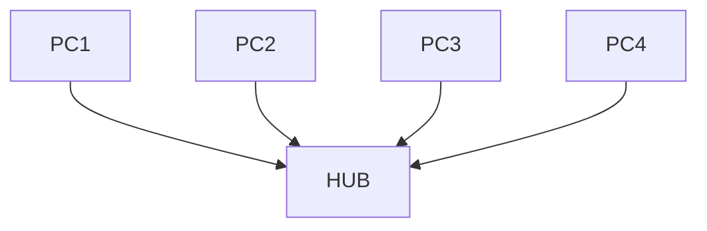
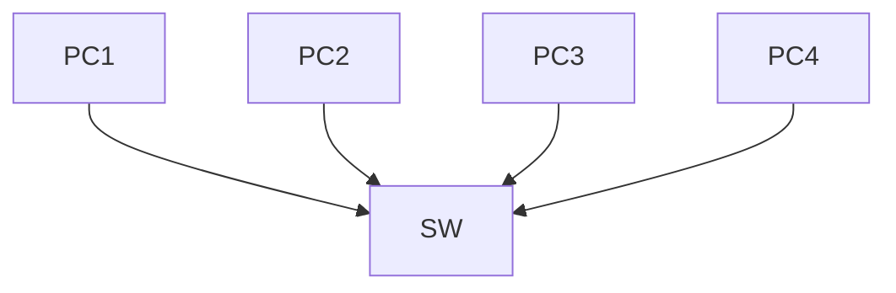
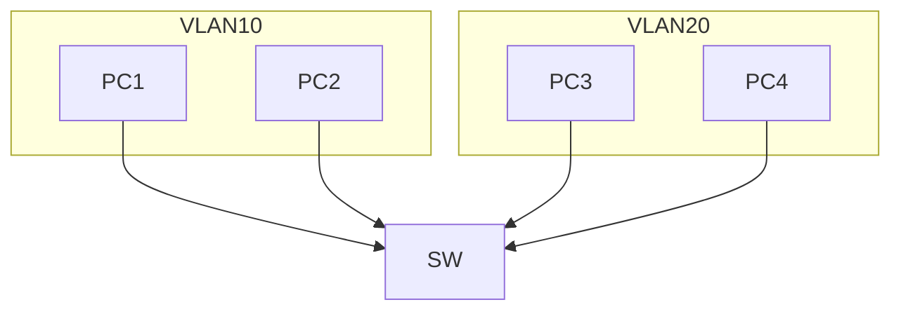
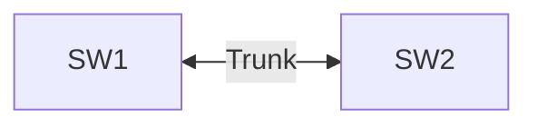
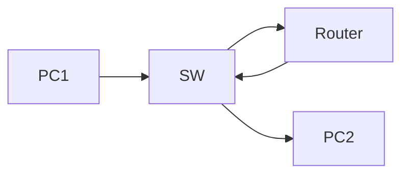
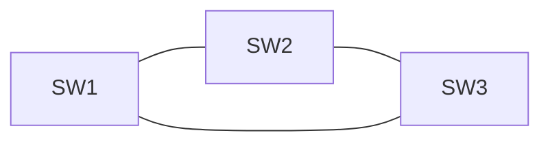
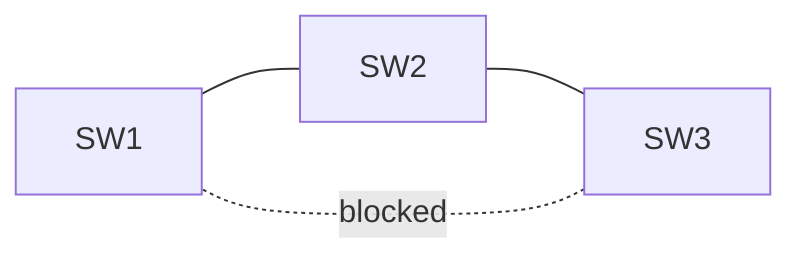

## 3.3 局域网技术（LAN）

> 本章是网络工程师考试 **最核心章节之一**。  
> 几乎所有下午案例题都会涉及：  
> VLAN / STP / Trunk / 链路聚合 / WLAN。

理解本章后，你将真正理解：

- 为什么网络会“广播风暴”
- 为什么需要 VLAN
- 为什么需要 STP
- 为什么交换机需要 Trunk

# 3.3.1 局域网基本概念

局域网（LAN，Local Area Network）是指：

```text
在有限区域内，通过高速链路连接多台设备的网络
```

典型环境：

- 办公网络
- 校园网
- 数据中心网络

常见技术：

```text
Ethernet（以太网）
```


# 3.3.2 IEEE 802 标准

以太网由 IEEE 802 标准定义。

| 标准 | 内容 |
|-----|-----|
| 802.3 | 以太网 |
| 802.1Q | VLAN |
| 802.1D | STP |
| 802.11 | WLAN |


## 缩写对照表

| 缩写 | 英文 | 中文 | 说明 |
|----|----|----|----|
| LAN | Local Area Network | 局域网 | 小范围网络 |
| VLAN | Virtual LAN | 虚拟局域网 | 二层隔离 |
| STP | Spanning Tree Protocol | 生成树协议 | 防止环路 |
| WLAN | Wireless LAN | 无线局域网 | WiFi |


# 3.3.3 冲突域（Collision Domain）

早期以太网使用：

```text
CSMA/CD
```

补充：在“交换机 + 全双工”的现代以太网中，端口独占链路、不会发生冲突，基本不再依赖 CSMA/CD；CSMA/CD主要对应早期共享介质/半双工场景（如 Hub）。

如果多个设备同时发送数据：

```text
会发生冲突
```

冲突域定义：

```text
可能发生数据冲突的网络范围
```


## Hub 网络结构



特点：

```text
所有设备共享带宽
```

因此：

```text
一个 HUB = 一个冲突域
```


# 3.3.4 交换机与冲突域

交换机出现后：

```text
每个端口一个冲突域
```

示意：



特点：

```text
每个端口独立通信
```

因此：

```text
4台设备 = 4个冲突域
```


# 3.3.5 广播域（Broadcast Domain）

广播域定义：

```text
广播报文能够传播到的网络范围
```

典型广播：

- ARP
- DHCP Discover


## 未划分 VLAN


结果：

```text
整个交换机 = 一个广播域
```


# 3.3.6 VLAN（虚拟局域网）

VLAN = Virtual LAN

作用：

```text
把一个物理网络划分为多个逻辑网络
```


## VLAN 划分示意



结果：

```text
两个广播域
```


# 3.3.7 VLAN 的优势

### 1 减少广播

```text
广播只在VLAN内部传播
```


### 2 提高安全

不同部门网络隔离。

例：

```text
财务 VLAN
技术 VLAN
访客 VLAN
```


### 3 灵活管理

设备位置改变：

```text
只需修改 VLAN
```

不需要重新布线。


# 3.3.8 VLAN 端口类型

交换机端口有三种模式：

| 模式 | 说明 |
|----|----|
| Access | 连接终端 |
| Trunk | 交换机之间 |
| Hybrid | 混合模式（华为） |


## Access 端口

特点：

```text
只属于一个 VLAN
```

补充要点（记考点即可）：
- Access 口连接终端，通常收发**不带 802.1Q Tag** 的帧。
- 交换机会把该端口的未打标签帧归入端口的缺省 VLAN（PVID）。

示意：


## Trunk 端口

Trunk 用于：

```text
交换机之间传输多个 VLAN
```


示意：



Trunk 使用：

```text
802.1Q 标签
```

标记 VLAN ID。

补充：Trunk 口用于承载多个 VLAN 的流量；在工程里常有“本征/Native VLAN”（不打标签）这一概念，考试题目会用它来出易错点。


# 3.3.9 802.1Q VLAN Tag

以太网帧增加：

```text
4字节 VLAN Tag
```

结构：

```
| 目的MAC | 源MAC | 802.1Q Tag | EtherType | Payload | FCS |
```

其中：

```text
VLAN ID = 12 bit
```

补充：802.1Q Tag = TPID(0x8100, 2B) + TCI(2B)，TCI 中包含 PCP(优先级)、DEI、VID(VLAN ID)。

范围：

```text
0 - 4095
```

可用：

```text
1 - 4094
```

补充：VLAN ID 中 `0` 常用于仅携带优先级信息（不代表具体 VLAN），`4095` 保留不可用；考试题会用它们做范围陷阱。


# 3.3.10 VLAN 间通信

不同 VLAN 之间：

```text
不能直接通信
```

必须通过：

```text
三层设备
```

例如：

- 路由器
- 三层交换机


## Inter-VLAN Routing




# 3.3.11 生成树协议 STP

如果交换机形成环路：



广播会无限循环。

这就是：

```text
广播风暴
```


## STP 作用

STP = Spanning Tree Protocol

作用：

```text
自动阻断冗余链路
```

形成无环网络。


## STP 工作示意



其中：

```text
一条链路被阻断
```


# 3.3.12 RSTP

RSTP = Rapid STP

特点：

```text
收敛更快
```

传统 STP：

```text
30 - 50 秒
```

RSTP：

```text
1 - 3 秒
```


# 本章高频考点

考试最常考：

```text
VLAN
广播域
冲突域
Trunk
STP
```


# 模拟练习

## 1

一个交换机 24 端口，没有 VLAN。

广播域数量：

A 1  
B 24  
C 12  
D 不确定  


## 2

交换机每个端口属于：

A 一个冲突域  
B 一个广播域  
C 一个网段  
D 一个IP地址  


## 3

VLAN 技术工作在哪一层？

A 物理层  
B 数据链路层  
C 网络层  
D 传输层  


## 4

STP 的主要作用是：

A 提高带宽  
B 防止环路  
C 加密通信  
D 路由选择  


# 答案与解析

1 A  
解析：未划分 VLAN 时，整个交换机一个广播域。

2 A  
解析：交换机每个端口一个冲突域。

3 B  
解析：VLAN 属于二层技术。

4 B  
解析：STP 防止交换网络环路。


# 本章理解标准

如果你已经理解：

```text
冲突域
广播域
VLAN
Trunk
STP
```

那么：

```text
80%的局域网题目已经掌握
```


下一节我们将进入：

```
3.4 网络互连与因特网
```

这里将讲：

- IPv4 地址
- ARP
- ICMP
- TCP / UDP
- OSPF
- BGP

这部分是：

```text
下午案例题核心
```
```
