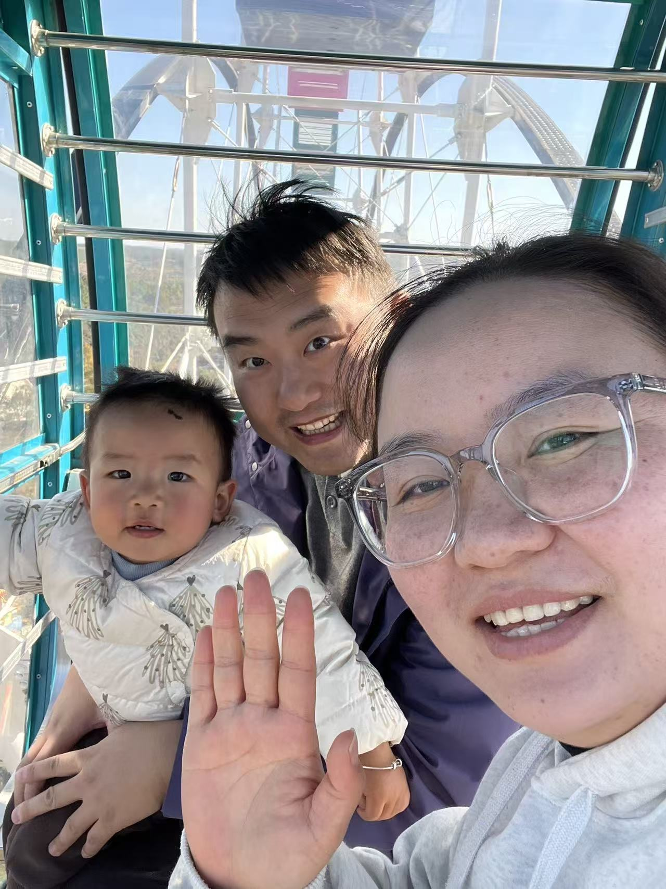

今天又带小杨去了动物园，我们一起做了摩天轮，你长大了，我和爸爸明显体力不支，一圈下来累的不行，不过这次来回路上挺乖，各睡了一觉。在动物园依然对垃圾桶最感兴趣[捂脸]，对动物也有反应，我们一起看了熊，狼，老虎，长颈鹿，还喂了羊，鹿，马，天气超级暖和，小杨中间也一度困到不行。睡醒回到家又调皮起来，最近喜欢玩唇膏，推积木，零食水果能一直吃。宝宝现在已经习惯爸爸妈妈要去上班，还会乖乖和我们说再见，爸爸妈妈也想有时间就多多陪你长大，希望你每天都开开心心，无忧无虑[亲亲][亲亲][亲亲]

