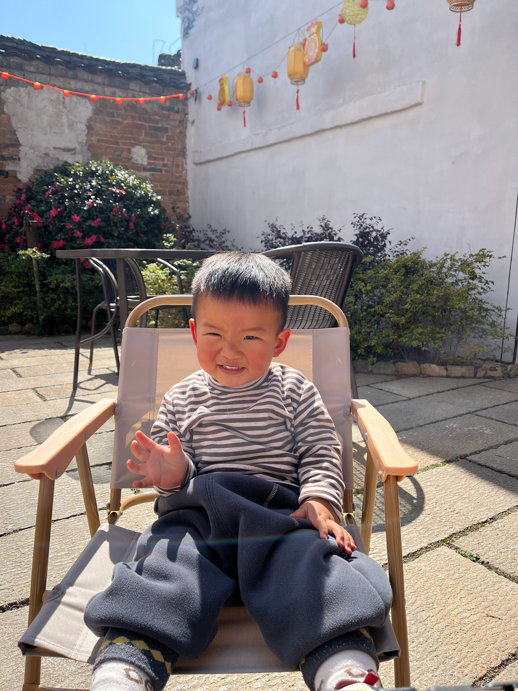
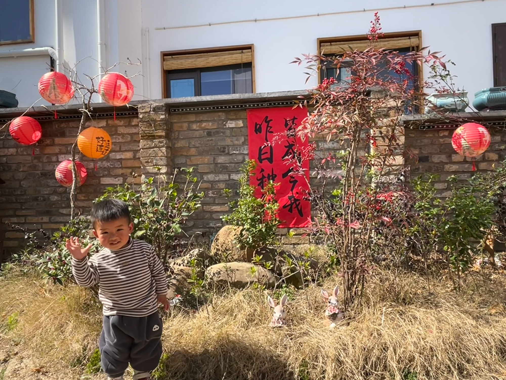
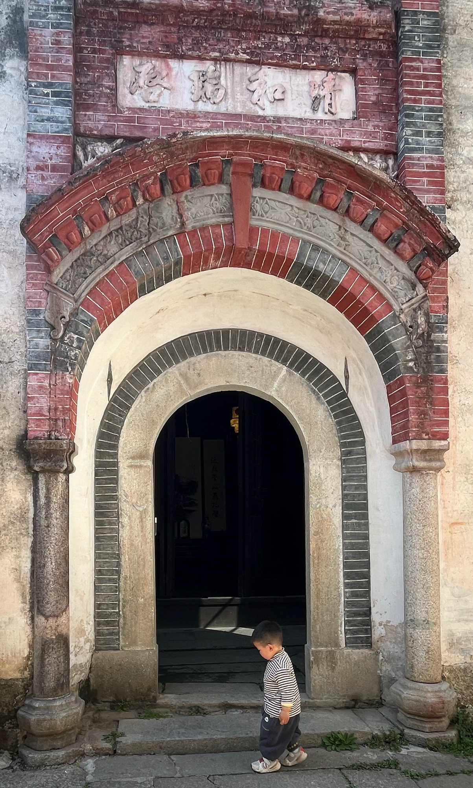
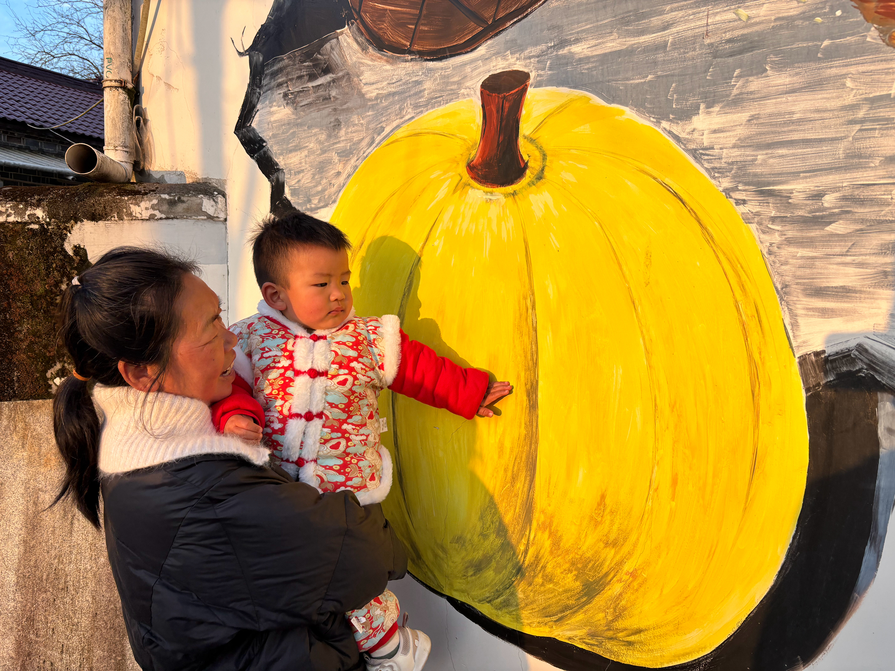

要过年啦，爸爸还是要到过年前一天才能放假，不过爸爸头一天下午就请假回绩溪了。除了给妈妈带了一个肩颈按摩仪，还给宝宝带了个卡皮巴拉，然后果然宝宝一点都不喜欢。在过去的几天里，宝宝已经在各种大姨家里学会了好多词，什么哥哥、姐姐信手拈来，跟你说"弟弟"触发你说"妹妹"也是摸不着头脑。

过年的前一天，天气格外暖和，爸爸妈妈带着宝宝去了上庄，在一个店家的院子里，你兴奋地到处走走看看，在妈妈的手机前格外地有镜头感，爸爸说要跟妈妈挥手，你就十分可爱地笑起来、倾斜着小脑袋向妈妈挥手。后来爸爸发了个朋友圈，说你有着超绝的镜头感和职业假笑，嗯，有30多个叔叔阿姨给你点赞呢。

   

除夕里，我们中午在爷爷奶奶家吃了团年饭，下午去了"崽崽"弟弟家里，和崽崽一起踩了摔炮、坐了摇摇车，还和弟弟一起跳了舞。晚上又来到绩溪和妈妈这边的亲戚们一起吃年夜饭。今年的过年和去年不太一样，烟花禁放又严了起来，说起来年味确实有点缺，但是好在你能睡个好觉。

到新年了，我们到处去拜年了，拿了好多压岁钱，你总是在各种亲戚面前被要求表演节目。一会儿是"团团看这边"，一会儿是"团团笑一个"，一会儿又是"叫XX、快叫"，能反应过来的，你回过头也看一眼，但是大家让你叫的称呼里有好多你不会发音的，心情好的时候，你就挤出一个职业假笑，心情不好，就一点表情没有。不过，在所有的亲戚里，你最喜欢的就是晶晶大姨了，其他人要抱你出去，还要说带你出去玩、给你零食水果，晶晶大姨一伸手，你就要她抱，妈妈都可以不要的，是不是因为她很有很有亲和力呢。

晚上，妈妈突然开始担心你说话是不是太晚了，爸爸搜了好久，只能猜你是觉得现在的肢体和词汇已经够了。爸爸妈妈就觉得，不能再这么善解"团"意了，要让你想要说话。果然，第二天你再向爸爸妈妈要抱抱时，爸爸妈妈就会问，要谁抱抱啊，只需要2、3次，你就学会了说，爸抱抱或者妈抱抱。虽然，有的时候你会对着爸爸说妈抱抱，对着妈妈说爸抱抱，但是已经进步很大了，现在已经逐渐熟练，有时还会主动说爸抱抱或者妈抱抱。

时间总是过得飞快，爸爸的春节假期就要结束了。妈妈不止一次说，从一开始就在担心假期结束将我们分开，现在这一刻还是来了。爸爸在去高铁站前就频繁地跟宝宝说，爸抱抱，但是你并不是很领情。好在在去高铁站的车上，你乖乖的靠在爸爸怀里，在爸爸下车时，还很配合地跟爸爸挥手、拜拜。虽然十分不舍，但是爸爸还是要独自走向高铁站，妈妈在宝宝面前也没有拦住眼眶里的泪水。相比于其他人，我们虽然相隔不算远，但是总在被分隔，爸爸妈妈会努力，让我们早一天能够天天在一起。
