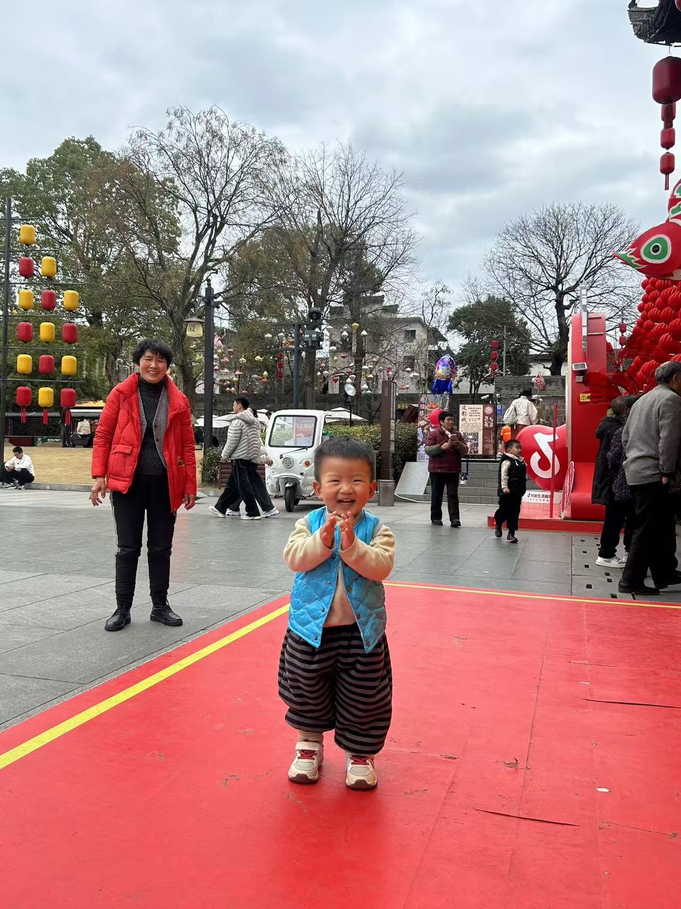
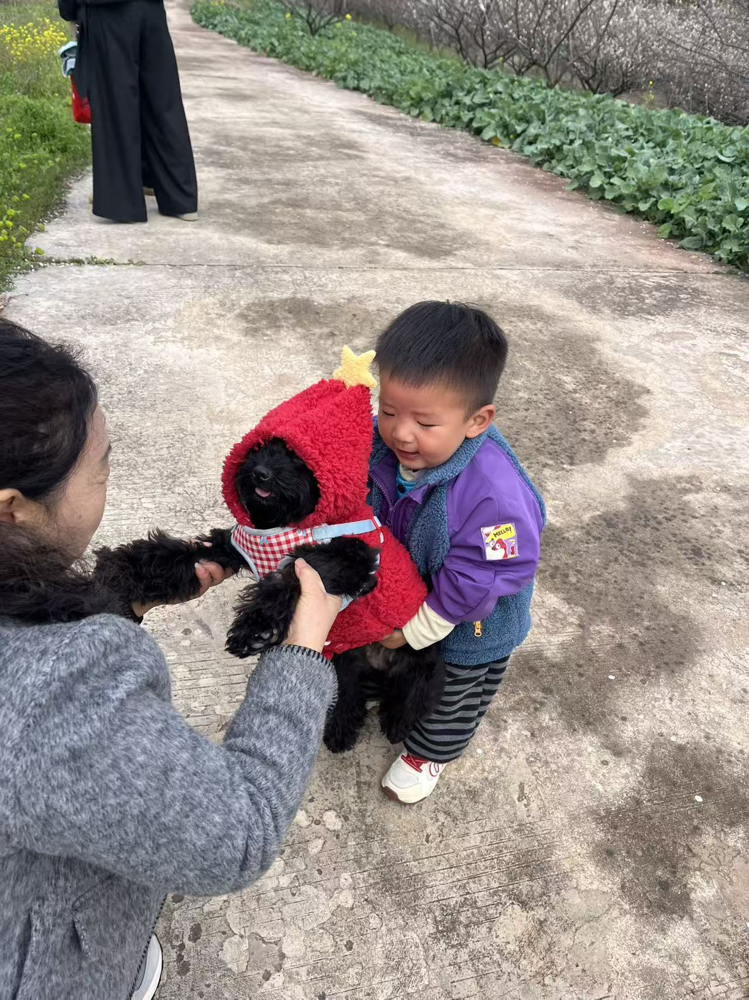
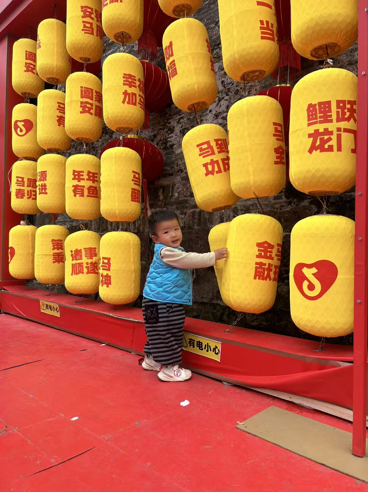

今天又是愉快的一天，和姑婆一家逛了练江牧场和徽州古城，在牧场非要和花卷交朋友，牵着它，其实也不知道谁牵谁😂还要喂它水果，抱它！到了徽州古城，本来都有困意了，但是看到这一派热闹的景象，马上要下来玩，不让任何人抱着，牵着，自己到处逛，在灯笼里穿梭，在斜坡上滑滑梯，上楼下楼乐此不疲！整个白天就睡了半个小时！晚上妈妈关了灯哄睡着，宝宝有点感冒流鼻涕，还自己跑到床边，让妈妈拿纸巾给他擦鼻涕，真是懂事的可人儿！好好休息吧。

  
