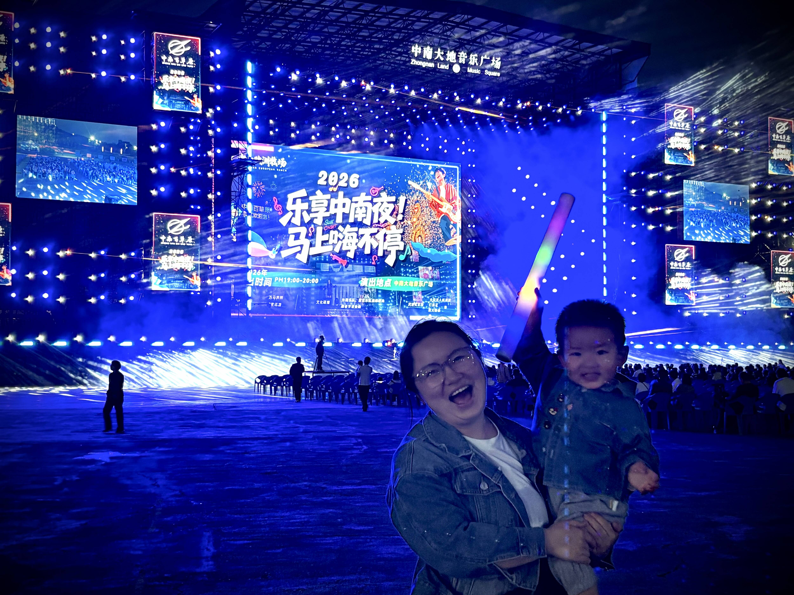

周末终于到了，爸爸妈妈带着你来到期待了一整周的安吉。
这里有穿梭在动物区间的小火车，你看着一路掠过的小动物和各种模型，兴奋得不停指来指去、嗯嗯直叫。小火车停在动物家门口时，爸爸妈妈让你拿胡萝卜喂它们，你却紧张得快哭出来，只催着我们上前代劳。不过就连妈妈，见到袋鼠也躲得远远的，生怕它突然挥来一拳。下午，我们又去看了酒店里的狮王、老虎和奔跑的马儿，但你似乎兴趣平平。等到入住后，你倒头睡了两个小时，醒来正好去吃晚饭。

晚上我们去了县城一家烤肉店。实话实说，味道很一般，网上宣传再热闹，也做不出真正好吃的饭。不过意外的是，你特别喜欢梅干菜饼，乖乖吃下了一整张。回到酒店后，我们又带你去看中南音乐会。你拿着荧光棒开心地挥舞着，还见到了人生第一次打铁花表演和演唱会。虽然现场歌曲没几个人会唱，灯光秀也晃得人眼花，爸爸妈妈还是提前带你回了房间。

愉快的假期第一天，就这样结束了。
