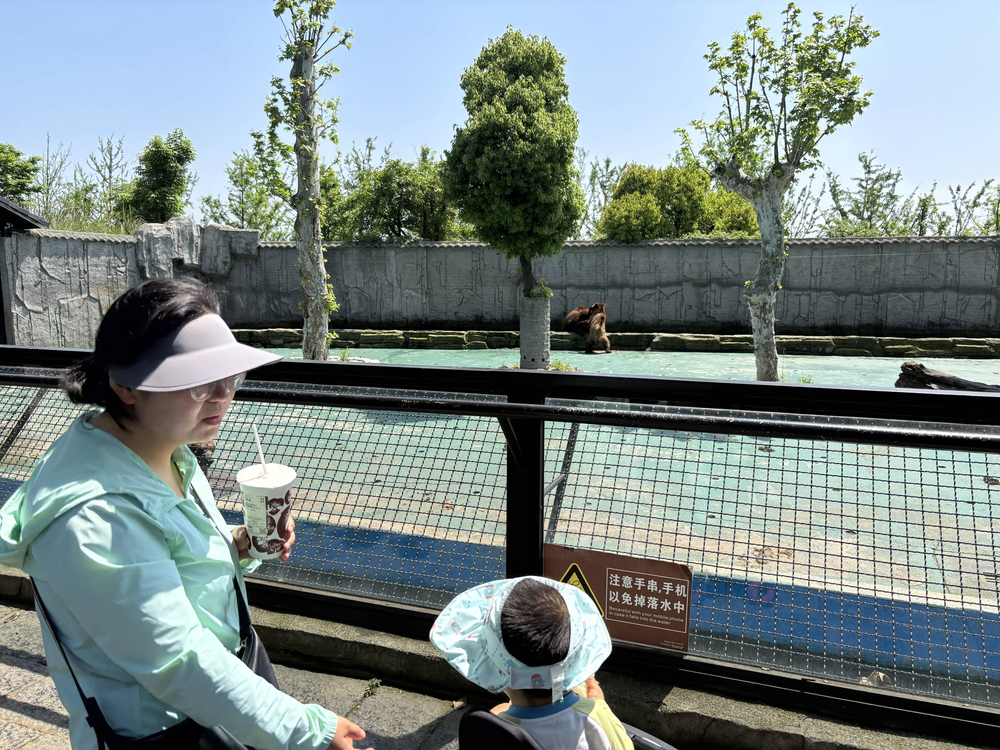

今天一醒来，我们就匆匆去吃早饭，想早点带你去中南百草园看小动物、玩游乐场。

爸爸开着租来的小电动车，载着你和妈妈慢悠悠到了园区。可惜旋转木马还没开放，于是先带你去玩挖机项目，像真的挖掘机一样，需要两个摇杆操作，可你还是兴趣不大，更喜欢站在旁边看别人玩。爸爸盯着过山车看了好一会儿，妈妈一眼看穿，立刻让爸爸去体验了一圈。虽然时间不长，但下来之后，爸爸感觉真是"人在前面跑，魂在后面追"。

后来我们一起坐了摩天轮，又去看小动物。和昨天一样，你一开始不敢喂，可爸爸渐渐发现，你不是不敢喂，而是不敢喂那些特别大的动物。和爸爸妈妈差不多高的，你躲得远远的；体型和你差不多的小动物，你就敢拿着胡萝卜伸手去喂。

所以，大耳羊和小兔子成了你的最爱，其他动物还是由爸爸妈妈代劳。走出动物园后，你还拿着别的小朋友送的饲料，跑去喂水里的大鱼。

这个周末，你真的完成了好多人生第一次。
