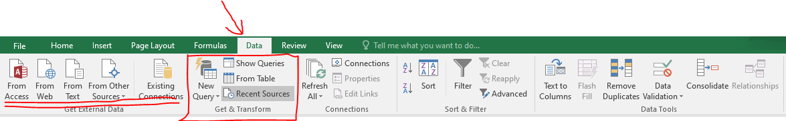
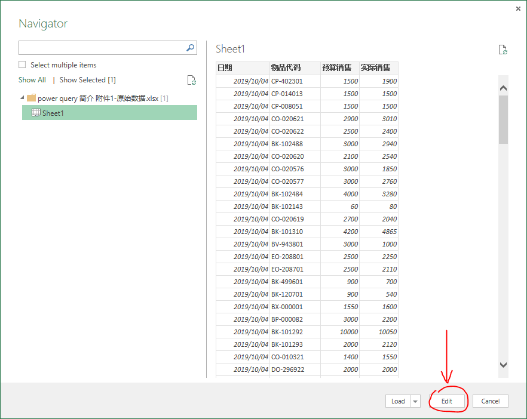
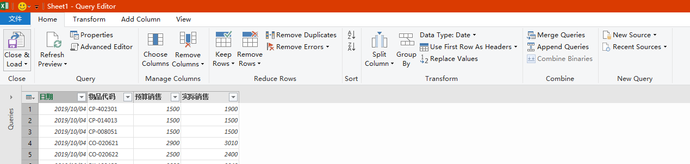
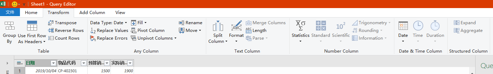
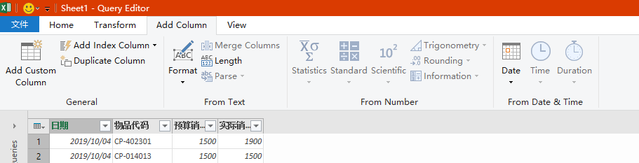
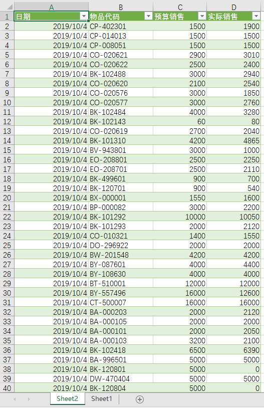
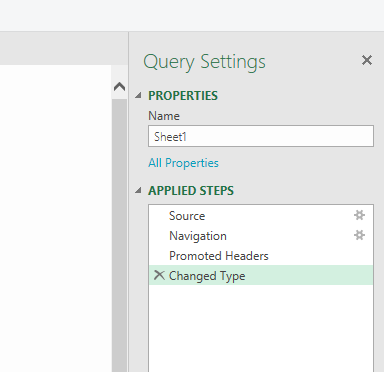

---
categories:
- 会用电脑
date: 2020-02-28
draft: false
slug: 20200228-01
tags: []
title: Power query插件简介 — 强大的excel辅助工具
---

## 前言

一直以来，excel都是被作为一个表格制作工具而不是一个数据处理工具来使用，不少人判断一个人对于excel的熟练程度往往都是看他能不能熟练地在excel里面添加各种花里胡哨的样式，而不是根据业务实际判断其对数据的组织方式的合理性。

本人在工作中使用excel做过大量的数据处理，然而，在引入较大量的数据比如100行以上的情况下，数据统计计算的复杂度就随着数据量的增长而成指数量级增长。

因此对于大批量的数据，本人倾向于1行记录1条数据进行存储，另开表格进行统计和计算。对于大批量的数据，利用excel自带的统计函数如SUMIF和AVERAGEIF在这种情况下就略显疲态，我们需要更强大的查询和统计工具。

## power query简介

power query是微软官方发布的一个excel插件，office 2016以上版本自带该工具，office 2010专业增强版、2013版本需要手动下载、安装[power query插件](https://www.microsoft.com/zh-CN/download/details.aspx?id=39379)。本文以office 2016版本为例，介绍power query的基本使用方法。2019版界面略有变化，请自行试验。

## 先决知识

- 基本的Excel公式知识。

- 充分认识到仅依靠公式面对批量的业务数据的局限性。

## power query编辑的基本思路

### 1、数据存储与数据处理

了解一些编程语言的读者应该清楚的一个原则是，我们需要将数据的存储与数据的处理分开，数据的存储应由处理数据的程序写入文件或者数据库、存储在硬盘上，在需要进行数据处理时，由程序将数据读取到内存中进行增删改查等操作。数据库程序作为数据处理的部分，则是常驻在内存中，而数据本身只有在需要的时候才会被读取，以减少内存占用。power query实际上就是提供了一个图形界面，用于编写和维护上述的处理数据的程序，我们不需要关心内存管理的问题。在power query处理过程中，我们需要关心的是数据处理的结果（power query生成的结果表格）与源数据的分离。

### 2、power query维护数据关系

由1我们知道，power query编辑的是`数据源 ====> 统计结果`的映射，我们维护的是这一对应关系，在后续有任何数据增加、更新时，我们只需要点击`刷新`按钮，power query 会根据我们事先编辑好地规则处理源数据，然后跟新最新的结果，不再是像传统的编辑excel表格的方式；

### 3、power query不直接修改行数据

正是因为power query预设的工作环境是源数据在不断变化，所以更改某一具体的行或单元格的数据是没有意义的，因此所有的操作基本对象是1列。比如，替换字符串的操作，power query不提供对某一些具体的单元格范围内的字符串进行查找、替换的功能，而是在1列内查找、替换数据，因此一列的数据必须要是同一类型且表示同一个含义。只有这样的数据，在我们进行批量操作时才有意义。

### 4、关系的鲁棒性

鲁棒性是在写代码中非常常见的一个词，音/意译自英语`robust`，实际上翻译成`健壮性`更容易理解，但是`鲁棒`这个翻译实在是太接地气了，又`“鲁”`又`“棒”`。不论是哪种翻译，都是在说程序的代码需要足够的稳定、健全。可是，

我们前面提到，power query编辑的是`数据源 ====> 统计结果`的映射，这个映射是靠一步一步的步骤处理每一列来实现的，因此我们需要尽可能考虑到每一步都应全面考虑到这一步出现的所有可能情况，保证数据源数据的合法性和power query中编辑步骤的全面性。比如，分解日期列就需要保证数据源这一列全部是合理的日期。替换不需要的符号的时候就需要将所有可能出现的不需要的符号全部替换掉，即便当前数据中没有出现。如果没有考虑到所有的情况，在后续更新数据时很有可能出现某一步报错，造成后续步骤报错无法处理。这个时候再来排查错误就会非常耗时。

## 基本的工作流程

对于一个基本的Power query的使用，我们首先需要准备如下的内容：

- 1行存储1条数据的数据源，文中使用了一个随机生成的数据列表作为示例

- 已安装了power query插件的excel

以上准备完成，我们就可以开始创建一个query：

1、打开空excel表格，切换到`数据`标签，可以看到左面的标签有几个不同的数据导入来源，由于我们刚刚开始，因此，我们选择`新建查询(New Query)` => `来自文件(From File)` => `来自工作簿(From Workbook)`，然后选择上面准备的数据源。

2、选择`编辑（Edit）`，进入power query编辑器。

3、进入编辑器后，我们可以看到一共提供了4个编辑标签页，其中前3个是我们经常使用的功能：`主页(home)`、`转换(transform)`、`添加列(add column)`

4、在主页标签下，我们可以数据分组统计计算、管理列（删除）、行（删除错误行，前n行，后n行），进行排序、分列、合并查询(merge query)、添加查询(append query)等操作

5、在转换标签下，我们可以调整列的数据类形，替换值，透视列或者反透视列，对列的数据进行计算，分析、格式化日期时间等操作

6、在添加列标签下，我们可以在保留原数据列的前提下，进行计算、解析并新增列。

在power query中，最常用的功能是`分组(group by)`，合并查询(常用成多条件vlookup)、添加查询(同一类表格数据的合并)、日期时间解析和字符串的处理，这几项功能是我们在处理批量数据中最需要的功能，对批量的数据进行分组统计、并分配好对应的时间、分类之后得到的最终数据，即可再使用excel自带的透视图标进行分析。

如果你需要一个源数据分多个透视表进行分析，也可以在power query中在某一步查询后复制查询，作为同一个数据源的分支，另行处理数据至想要的状态。

7、处理数据后，我们点击主页标签下的`关闭并上载(close & load)`即可将编辑后的数据导入到excel表格中。

power query生成的数据会新开一个标签，不会覆盖当前的工作表。上载数据后，我们会发现，当我们选中任意一个由power query生成的数据单元格的时候，excel会多出两个标签，`表设计`和`查询`，后续如果发生数据更新时，直接点击`查询`标签下的`刷新`即可。

**注意:** 请在创建查询之前就将数据源表格放在你最终需要它们的文件夹下，否则事后移动数据源文件会导致查询找不到文件。

8、当然，我们可以更改每一步步骤的参数，在编辑器的右边提供了步骤窗口，我们可以在这个窗口插入、删除、修改步骤：

插入步骤：选中你想要插入步骤的位置的前一个步骤，然后在标签页进行需要插入的操作即可；

- 删除步骤：点击每一步前面的叉即可

- 修改步骤：能够修改的步骤在后面都有一个齿轮，点击齿轮则会弹出这一步骤的操作窗口

因此如果我们移动了工作簿的位置，就可以点击`源(Source)`，并找到移动后的源数据工作簿的位置。

## 结语

power query 实际上是帮助我们方便地将数据源和数据结果分离的工具，作为真正的自动化工具非常适合各类市场、销售、运营等部门使用，配合透视图表能够自动化、可视化地更新各种日常化的数据，能够为制作报表的人员节省大量的时间，并且还能确保数据格式、图表规则的统一性。

关于分组、合并查询、添加查询等功能具体教程会在后续继续增加，敬请期待。当然，你也可以自行尝试摸索，我相信自己摸索出来的知识远比看教程记得要牢固的多。

## 题外话

对于互联网公司或者自行运行了sql数据库的大型企业，更适合使用微软基于power query、power map等工具研发的Power BI，它从数据库等获得数据源、通过查询工具加工处理，再通过power map 和透视图表和其他可视化部件直观地展现当前的运营状态等数据，同时还提供了移动端的报表面板，非常适合各种大中型企业使用。