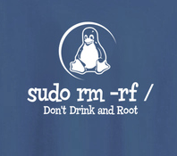
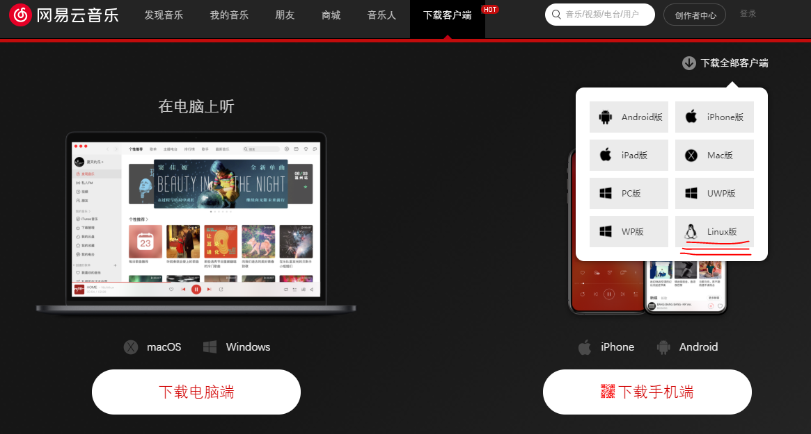
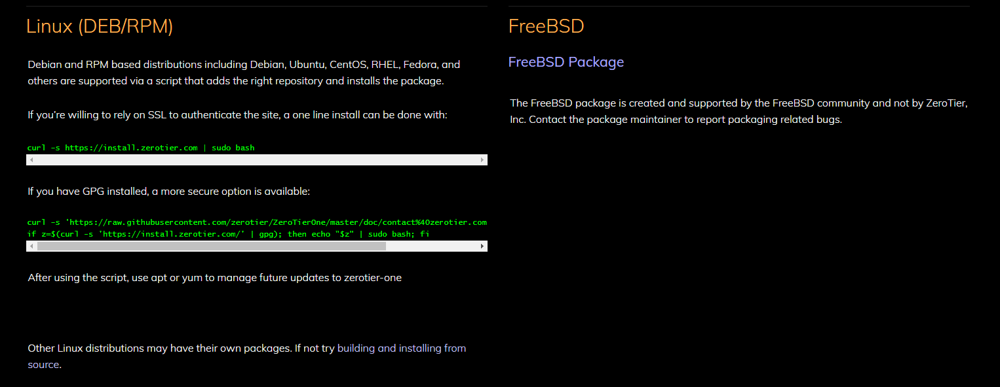
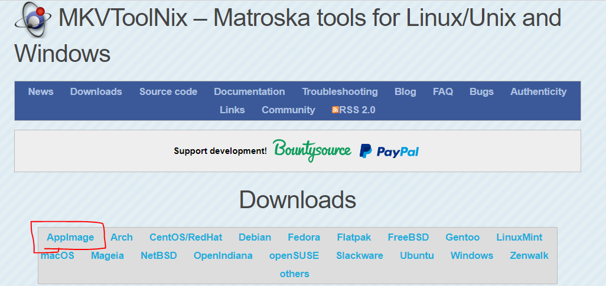

---
categories:
- 会用电脑
date: 2020-06-05
draft: false
slug: 20200605-01
tags: []
title: Deepin入门指南
---

## 1\. 简介

当前的大环境下，不少单位可能会面临无法通过正式渠道获得windows操作系统和相应支持的情况。一些单位或个人已经转向国产操作系统，比如ubuntu kylin（麒麟）、deepin（深度）等。比如华为笔记本提供了预装Linux的版本，预装的就是Deepin。Kylin、deepin、ubuntu等都是Debian系的Linux发行版（Debian也是一个Linux发行版本），在目前我的使用体验来说，和Ubuntu的体验没有什么大的区别，你可以使用Ubuntu的教程或者文档，但是深度提供了专门本地化的软件商店和桌面环境，还提供了一些Windows 软件的wine打包版本，使得新手能更方便的安装和使用。

对Linux新手：请注意，所有Windows下的exe可执行程序，都不能在Linux平台下直接运行，部分程序可以使用wine模拟器来运行，但请注意，即便有wine模拟器，Linux下能运行的Windows程序依然不多。

## 2\. 适用人群

最低能力配置：

- 愿意尝试新东西

- 有阅读文档并尝试解决问题的耐心和时间

- 知道自己电脑的操作系统版本、了解32位/64位操作系统以及自己电脑的硬件是否兼容

- Windows系统下熟练管理文件和软件

推荐能力配置：

- 对软件操作有较为抽象的步骤概念，可以使用不同界面的软件完成相似的任务（例如在WPS和MS Office间可无压力切换）

- 英文文档阅读能力

- 梯子

- 基础cmd或powershell命令，如`cd`、`mkdir`、`ls`等

当然如果你有Ubuntu或Debian或者其他发行版的使用经验，那么你**不需要**这个指南。

## 3\. 系统安装

U盘安装系统与Windows基本无异：用[rufus](https://rufus.ie/)或其他U盘启动制作工具将iso镜像刻录到U盘中，然后重启，在BIOS中将第一启动项更改为U盘（或者相应的UEFI分区），开机按提示设置用户名、密码然后等待安装完成即可。详细安装教程可见[官方教程](https://www.deepin.org/installation/)

注意：安装向导询问安装位置时，请不要自行分区和设置挂载点，直接选择全盘安装到一整块不小于40GB的硬盘中，后续我们再涉及磁盘管理的问题。

## 4\. 基本GUI界面使用

GUI = Graphical User Interface，即图形用户交互界面，与之相对的是字符界面，只能输入命令执行任务。Deepin的UI界面与Windows有较大的差距，但是请不要慌，他们的基本操作逻辑大致相同：

- 双击打开/右键菜单

- 删除文件到回收站/从回收站恢复文件

- 设置界面更接近手机的设置界面

- ……

事实上，Deepin的设置等界面其实更接近安卓或者iOS系统，UI界面的操作方法都是很简单的，当然右键菜单的内容比Windows上要少一些，其他的一些不好找的设置可以参考官方用户手册：[https://wiki.deepin.org/](https://wiki.deepin.org/)

## 5\. 文件结构基本逻辑

### 5.1 根目录的概念

前面安装系统时安装向导会询问系统的安装位置，官方教程中提到了根目录：`/`。请注意，在操作系统中，目录=文件夹，请注意这一措辞的变化。

与Windows的文件结构不同的是，无论你有多少硬盘、分了多少分区，所有的目录都在根目录下，我们在Windows下熟悉的诸如**C盘**，**D盘**等盘符的概念，在Linux操作系统中是不存在的，不同的分区和硬盘都是以目录（挂载点）的形式在文件系统中管理，例如：我们可以将C盘理解成 **根目录-C目录**：

```
/
|
+----C/
|
+----D/
|
+----E/
|
+----F/
```

### 5.2 家目录的概念

家目录就是/home目录，系统会默认在这个目录下创建一个与用户名同名的目录，用于存放该用户的所有文件。目录结构如下：

```
/
|
+---- home/
        |
        +---<用户名>/
            |
            +---文档/
            |
            +---音乐/
            |
            +---图片/
            |
            +---下载/
            |
            +---视频/
            |
            +---……
```

请将所有的文件例如文档、照片、视频、软件安装包等内容分类放在你的目录下。默认情况下，新用户只有自己的家目录的写权限，其他文件最多只会有读权限（**请注意**：**删除**也是**写**操作）。

### 5.3 root权限

**注意：** _由于本文面向新手，所以会尽量少介绍命令，此处内容了解即可。_

root用户、用户组有系统最高的权限，可以无视任何文件权限配置读写文件系统下的任意一个文件或目录，那也就是说拥有“**一键删除一切**”的功能：



_（注意：Windows下的Administrator权限是用户能获得的最高权限，并不是系统的最高权限，不能和root类比）_

在系统安装时添加的第一个用户会默认加入root用户组，直接执行命令时仅仅是以用户本身的权限执行。如果需要root权限，就在命令前加上sudo，然后会提示输入用户密码，以root用户的身份执行相应的命令。

请注意，只有加入了root用户组的用户才能借用root权限。正是因为root权限几乎是“无可阻挡”，以root身份执行命令时请务必谨慎。

文件的权限可以使用[chmod](https://man.linuxde.net/chmod)更改，大多数情况下，需要借用root权限，即使用`sudo chmod ...`

## 6\. 压缩文件与解压缩

### 6.1 文件格式

请注意，在Linux平台下源码包的打包压缩格式常常为`.tar.gz`，其他文件的压缩包多为`zip`格式。另外虽然Deepin也添加了7z、rar等格式的支持，请在打包压缩文件时尽量选择`zip`或`tar.gz`/`tar.bz2`格式

### 6.2 压缩和解压缩

deepin的压缩和解压非常简单，与Windows相同，在压缩包上右键-压缩/解压，按提示选择保存位置即可。

## 7\. 软件的安装与卸载：

如同在简介中提到的，你下载一个Windows的程序到Linux平台下会发现打不开/无法运行，Linux平台的软件包是通过与windows完全不同的方式安装的。请通过以下方式安装软件：

### 7.1 软件商店

第8节中的软件可以首先尝试在深度自带的应用商店中搜索，尝试安装前，请先到设置中更新软件信息，更新完成后才能正常安装，否则会报错。

优先安装备注了Linux版的软件，而不是wine版本的，网页版最不推荐安装，有些软件是打包浏览器的网页版本， 没有备注，这种只能是下载后使用时才能发现。

### 7.2 下载deb包

并不是所有的软件都收录到了深度的软件商店中，另外一些软件需要我们自行下载安装包，请注意即便同样是Linux平台，不同格式的软件包也不是通用的，Debian系发行版的软件安装包都是`.deb`后缀，这也是最常见的一种格式，以网易云音乐为例：



其下载客户端的页面提供了Linux版本的下载，选择自己对应的发行版下载后，双击安装即可。无论是双击deb安装还是直接在软件商店内下载的软件都可以直接在已安装软件列表中一键卸载。

### 7.3 apt/apt-get/dpkg命令

**注意：** _7.3及后续的安装方法了解即可_

上述通过商店安装软件实际上就是用过apt命令安装了对应的安装包，apt又是通过调用dpkg进行解包、安装，如果你需要安装一个名为smartmontools （硬盘检测）的软件包，那么，你只需要打开终端或者按下Ctrl+Alt+T调出终端，然后输入命令：

```
sudo apt install smartmontools -y
```

回车，终端会提示输入密码，按要求输入你的密码然后回车后就会进行下载和安装。不过你能使用apt安装一个软件的前提是，软件开发者已经在apt的源仓库中已经提交了对应的软件包，和商店的其实是很相似的。

卸载软件只需要运行：

```
sudo apt remove <软件包名> -y
```

输入密码，回车确认即可。

**那么我们能不能用命令安装自己下载的软件包呢？**答案是可以的。我们以网易云音乐（假设文件名为：`netease_music.deb`）为例，在官网下载了安装包后，打开到安装包所在的目录，然后右键-在终端中打开，然后输入

```
sudo apt install ./netease_music.deb -y
```

回车，输入密码再回车即可安装

当然，也可以使用`dpkg`命令进行安装：

```
sudo dpkg -i ./netease_music.deb -y
```

那么`apt-get`又是什么命令呢？`apt-get`基本等同于`apt`命令，后者更新，我们应使用更新的版本。

注意：由于商店和`apt`/`apt-get`命令都使用了`dpkg`命令，如果你正在安装或更新deb软件包，它就会被加锁，在其结束安装或更新前，你将不能再打开一个安装或更新过程。软件商店安装失败多半是因为系统在后台运行了一个更新过程，所以，安装失败的时候请先到设置里确认更新是否在运行中。

### 7.4 脚本安装

部分软件不能通过apt安装，也没有提供deb包，但是在下载页面提供了一个脚本，我们可以打开终端，直接复制粘贴脚本，回车即可安装，例如zerotier-one（虚拟局域网工具）：



注意：有一些通过脚本安装的软件可能不会提供卸载方法或者卸载方法比较复杂，这类软件的安装务必谨慎进行。另外脚本安装的可能是deb包软件，也可能不是，具体请阅读对应软件的安装说明。

### 7.5 其他类型：snap，appimage

- Snap：Snap是Canonical公司（Ubuntu的发行公司）的新一代包管理器，安全方便，部分软件会提供snap包，但它的权限管理比较复杂，初学者请不要尝试安装该类软件包。

- appimage：部分软件在Linux平台会提供appimage，这种包将其需要的所有依赖软件全部打包在一起，因此通常来说体积会比较大，但是不需要担心任何依赖问题，基本可以做到在任何发行版中，双击即可运行，因此，在没有提供deb包时，可以优先选择appimage格式打包的软件，例如mkvtoolnix就在下载页面提供了appimage：



### 7.6 源码安装：

有些软件提供源码包，需要自行编译安装。与一些脚本安装的软件类似，编译安装的软件往往依赖较多的外部软件包，需要手动安装，而且安装文件的步骤多，部分源码包不提供卸载方法，编译源码安装的软件同样不适合新手使用。

如果你有了解`cd ls mkdir`这类基础命令，可以参考源码包内的安装方法（大多是英文），然后参考[本文](https://blog.sergget.ga/20200418/6a36829358ea/)安装源码包

## 8\. windows平台软件的替换

靠前=更推荐，深度提供了部分工具：录屏、截图、分区工具

1. 输入法：搜狗（预装）、Sunpinyin

3. 浏览器：chrome（预装）、firefox

5. Office三件套: WPS（预装）（Ubuntu下默认安装的字体和Windows下有很多不同，请自行搜索下载需要的字体）

7. 邮件客户端：Evolution、Thunderbird（预装）

9. pdf阅读器：福昕阅读器Linux版、Okular、金山PDF（预装）

11. 流程图/Visio替代：Dia

13. 下载：qbittorrent、uget、百度网盘Linux版

15. 笔记：Evernote(使用第三方linux客户端Nixnote)、为知笔记（会员或[自行部署服务端](https://www.wiz.cn/zh-cn/enterprise-private-cloud.html)）、simplenote

17. 网页剪辑：pocket扩展+手机端应用

19. 视频相关：
     - 播放器：VLC、kodi
     
     - 剪辑：kdenlive、shocut
     
     - 字幕编辑：subtitle editor
     
     - mkv打包和拆包：mkvtoolnix
     
     - 视频转码：HandBrake
     
     - 录屏：kazam
     
     - 3D动画：Blender

21. 音乐播放器：网易云音乐、VLC、Spotify

23. 图片和照片：
     - 相册：shotwell、digikam
     
     - PS替代：GIMP
     
     - 矢量图：InkScape

25. CAD：中望CAD Linux版、freeCAD

27. 虚拟局域网：zerotier-one

29. 虚拟机：Virtualbox

31. 梯子：Github上搜索你使用的协议名称+Linux即可，有UI的更好。不要问推荐什么，咱不知道。

## 9\. 磁盘分区和管理：

如果你没有在Windows下使用过系统自带分区工具、diskgenius或其他的分区工具，请忽略本节内容，相关需求请联系专业人员处理。

### 9.1 GUI工具：disks

Deepin下使用系统自带的分区工具或者下载disks工具即可，操作其他的分区工具类似。

Linux下常用的文件系统为`ext3`, `ext4`，不能直接使用Windows常见的NTFS文件系统，对于一些小文件需要在Windows和Linux之间频繁切换的U盘可以格式化成`FAT32`格式，这种文件系统在两个平台上都能直接使用，代价是不能存储单个大于4G的文件。

如果一定要使用NTFS文件系统，可以使用如下命令安装软件包：

```
sudo apt install ntfs-3g -y
```

即可挂载NTFS分区

### 9.2 命令行：parted/fdisk+mkfs

Linux平台下更多的使用命令行来对硬盘进行分区和格式化，常用的分区命令：parted、fdisk，格式化工具：mkfs（make file system）

关于这些命令的使用，可以阅读：

- parted命令：[https://man.linuxde.net/parted](https://man.linuxde.net/parted)

- fdisk命令：[http://man.linuxde.net/fdisk](http://man.linuxde.net/fdisk)

- mkfs命令：[https://man.linuxde.net/mkfs](https://man.linuxde.net/mkfs)

请注意：parted用于gpt分区，fdisk用于mbr分区

### 9.3 挂载点的概念

挂载点是Linux平台与Windows平台对存储资源管理的最大不同点之一，由于Linux平台文件系统始终以根目录作为最初始的目录，如果我们需要使用硬盘的某一个分区，就只能把它作为一个目录添加到Linux的文件系统中，代表这个分区的目录就被我们称作挂载点，为硬盘分区分配一个目录的动作就被称为挂载。

我们存储在挂载点这个目录的所有文件，在物理上就存储在其对应的硬盘分区中。

分区的挂载操作和卸载操作：

- 挂载分区：[https://man.linuxde.net/mount](https://man.linuxde.net/mount)

- 卸载分区：[https://man.linuxde.net/umount](https://man.linuxde.net/umount)

**注意**：使用mount命令挂载的分区会在重启后消失，如需要开机就自动挂载，请阅读：[https://www.cnblogs.com/qiyebao/p/4484047.html](https://www.cnblogs.com/qiyebao/p/4484047.html)

如果你新增加了一块硬盘，需要将你的家目录转移到该硬盘上，可以参考：[https://sergget.ga/20200426/0cad07e5443e/](https://sergget.ga/20200426/0cad07e5443e/)

## 10\. 小结

由于Linux教程大多是开篇介绍命令，对于桌面用户非常不友好，所以本文致力于介绍其逻辑，但是即便deepin做了很多本地化和图形化的工作，作为一个Linux系统仍然有很多地方不得不使用命令行/字符界面，作为桌面用户仍然需要适时地学习相关的命令。网上有很多Linux教程，可以参考视频教程：[https://www.imooc.com/course/programdetail/pid/45](https://www.imooc.com/course/programdetail/pid/45) 选择性地学习。

最后请善用搜索引擎（推荐必应，国内搜索引擎真是一言难尽）！

## 11\. 题外话

从第8节的可以看出，Deepin可以完成不少的基础和进阶任务，但一些特定的专业软件没有Linux平台的版本，即便有，也有很大概率是英文版，不适合在从事这一类活动的企业中大面积推广。这决定了它目前只能在一些政府单位等行业等文书类工作比较集中的地方，至于这些人能不能/愿不愿意学这个东西就是另外一回事了。

要说另一个好处就是适合仅限于“查资料/学习用途”的学生了，毕竟Linux平台下游戏少得可怜，质量还不好，即便是Steam平台有Linux版本，上面也有一些游戏，作为家长只要管控住银行卡，孩子们基本就没有什么游戏的空间。毕竟总不会有谁扫雷玩儿一天吧？不会吧？不会吧？