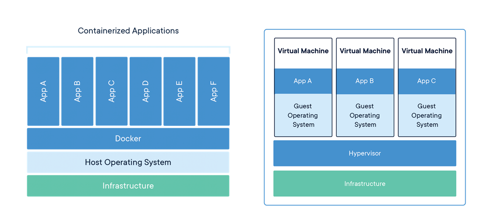

---
categories:
- 来点码吧
date: 2021-04-03
draft: false
slug: 20210403-01
tags: []
title: Docker新手入门
---

## 1\. Docker是什么？

Docker 是一个开源的应用容器引擎，让开发者打包他们的应用以及依赖包到一个轻量级、可移植的容器中，然后发布到任何主流操作系统上，也可以实现虚拟化。

## 2\. Docker解决什么问题？

软件开发阶段在开发者的设备上往往开发环境都是完整的，甚至“多余”的，然而：

- 在另一台机器（比如测试）上环境往往不同（软件、版本）

- 在生产服务器需要最小限度的环境配置

Docker可以在应用的层面上打包其所有的依赖并和操作系统实际的环境进行隔离，避免更改、污染操作系统本身的配置、文件或干扰其他进程。

## 3\. Docker与虚拟机？

Docker容器不是模拟一个完整的操作系统，而是对进程进行隔离。或者说，在正常进程的外面套了一个保护层。对于容器里面的进程来说，它接触到的各种资源（文件系统、网络）都是虚拟的，从而实现与底层系统的隔离。

Docker容器无需运行一个完整的操作系统，从而最大限度地降低对硬件资源的占用。



## 4\. Docker的安装与基本使用

### 4.1 安装

Docker安装请根据服务器操作系统选择相应的安装方法：

https://docs.docker.com/engine/install

### 4.2 使用

在我的个人服务器上曾部署过为知笔记的私有服务端，服务端就是以docker镜像的方式提供的;

[为知笔记官方部署教程](https://www.wiz.cn/zh-cn/docker)

官方教程中将容器的80端口映射到了本地机器的80端口，但是本人服务器还部署了nginx服务器的3个站点，因此本人将本地的8080端口映射到容器的80端口，并在nginx中配置一个反向代理来访问该为知笔记的docker容器（为知笔记的docker镜像无法代理到域名的子目录下）。

## 5\. Docker命令基础

以下命令介绍均以Linux平台下，windows平台的docker应该也是差不多的。

**注意：** docker在大多数情况下需要root或管理员权限，请适时增加sudo或以管理员身份打开命令行。

- 从官方源中拉取镜像：

```
docker image pull <image name>
```

- 查看本机镜像：

```
docker image ls
```

- 运行一个镜像：

```
docker container run <image name>
```

`docker container run`命令会从 image 文件，生成一个正在运行的容器实例。一个镜像相当于一个模板，可以创建运行多个容器。

**注意:** `docker container run`命令如果发现本地没有指定的 image 文件，就会从仓库自动抓取。因此，前面的`docker image pull`命令并不是必需的步骤。

- 查看正在运行的容器

```
docker container ls
```

- 查看所有容器（含停止的容器）

```
docker container ls -all
```

- 停止一个容器：

一些容器会在运行结束后停止，但大多数不会，因为它们提供的是一项持续的服务。停止这些容器就需要：

```
docker container kill <Container ID>
```

- 删除容器

容器停止后还会保留容器文件，占据硬盘空间，如果需要可以将其删除

```
docker container rm <Container ID>
```

## 6\. 制作docker镜像

本人由于是完全的业余折腾了下，还没到必须要制作一个docker的程度，我找了几个入门教程，希望对你有所帮助：

#### 制作docker镜像

- 请参考“**十、实例：制作自己的 Docker 容器**”：[Docker 入门教程](http://www.ruanyifeng.com/blog/2018/02/docker-tutorial.html)

- 较详细的dockerfile配置说明：[Docker Dockerfile](https://www.runoob.com/docker/docker-dockerfile.html)**注：**配置可以关注`COPY`,`CMD`,`ENTRYPOINT`,`ENV`,`VOLUME`,`EXPOSE`,`USER`命令配置

### 微服务与docker compose

对于一些较为大型或需要一定部署灵活性的需求，一般来说可以将语言环境如php，python和数据库等设施分开，分别运行在不同的docker容器中，教程可参考：

- [Docker 微服务教程](http://www.ruanyifeng.com/blog/2018/02/docker-wordpress-tutorial.html)

- [Docker Compose](https://www.runoob.com/docker/docker-compose.html)