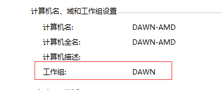
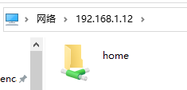
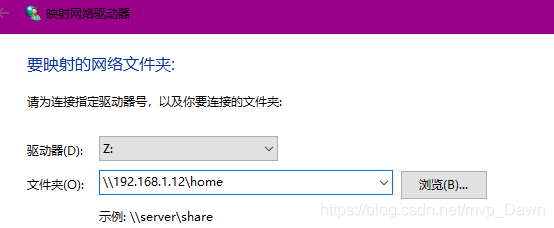
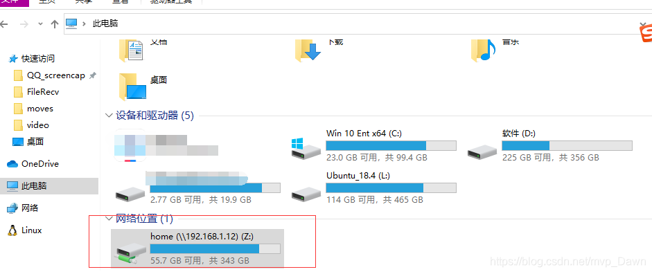

---
categories:
- 网络漫游
date: 2021-05-16
draft: false
slug: 20210516-02
tags: []
title: ubuntu 20.04 安装配置Samba服务
---

文章转自：[https://blog.csdn.net/mvp\_Dawn/article/details/105847485](https://blog.csdn.net/mvp_Dawn/article/details/105847485)

## 1\. 安装Samba服务

```
sudo apt-get install samba samba-common
```

如果安装失败，请检查你的网络，确认linux可以访问互联网，若可以联网请尝试更换ubuntu镜像源，桌面版直接在软件和更新中配置，服务器版百度上很多

## 2\. 配置需要共享的目录

改变需要共享目录的权限，让其他人可以更改文件和目录，以/home为例（若多人使用同一服务器建议在每个用户家目录单独共享，不建议共享整个home目录，防止误操作删除他人文件）

```
$ sudo chmod 777 /home/ -R
```

## 3\. 添加samba用户

添加samba用户，用于其他人或设备认证，这里添加的用户需要在系统账号中存在，否则添加失败

```
dwan@ubuntu20:~/桌面$ sudo smbpasswd -a dwan
New SMB password:
Retype new SMB password:
Added user dwan.
```

## 4\. 配置samba

先备份`sudo cp /etc/samba/smb.conf /etc/samba/smb.conf.bak`，以防改错，修改配置文件时建议养成备份的好习惯，改错了还能恢复，`sudo vim /etc/samba/smb.conf` 修改配置，添加共享，可直接加到文件尾

```
[home] #共享名，该共享标签，可随意取，该名字为在其他电脑上看到的共享名
    comment = home directories #该共享描述
    path = /home/  #共享路径
    public = yes   #指定该共享是否允许guest账户访问
    writable = yes #writable用来指定该共享路径是否可写
    workgroup = DAWN #设定 Samba Server 所要加入的工作组或者域
```

workgroup 根据windows工作组来确定，右键我的电脑（win10为此电脑）->属性 工作组，该选项有的版本需要配置，有的版本不需要，若访问不了可检查一下该配置，更多配置详见samba配置详解



## 5\. 重启samba服务

```
sudo service smbd restart
```

若找不到服务可尝试如下方法，不过得具体看，有的版本路径不是/etc/init.d/samba，比如我的为/etc/init.d/samba-ad-dc，可以看对应路径是啥，决定用哪个命令

```
sudo /etc/init.d/samba restart
#sudo /etc/init.d/samba-ad-dc restart
```

## 6\. 在Windows中访问samba服务

在Windows文件管理器中输入`\linux ip` 便可以看到linux samba服务共享的文件夹



## 7\. 将共享路径映射为Windows磁盘（非必须）

若经常使用的共享，可直接映射为Windows的磁盘，不用每次都输ip，但linux ip变了需要重新映射，所以建议将linux ip设为固定ip

我的电脑 ->右键 ->映射网络驱动器，文件夹输入框输入linux ip共享名，不能直接输ip，一定要加上共享名，点击完成



接下来就可以在我的电脑里看到映射的网络磁盘了



接下来你就可以在Windows上编写代码，然后在linux下编译验证了

引用：

https://blog.csdn.net/weixin\_40806910/article/details/81917077