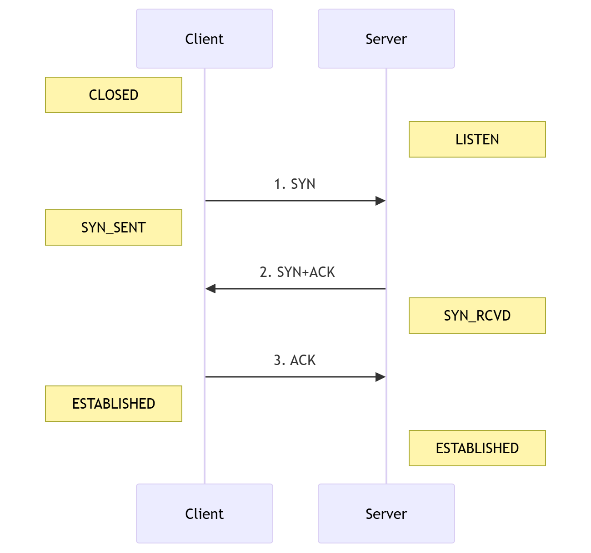

---
categories:
- 网络漫游
date: 2026-03-10
draft: false
slug: 20260310-01
tags: []
title: 深度解码：TCP 三次握手——为什么两次绝对不够？
---

在网络工程的学习中，很多人能背出 TCP 三次握手的过程，却常卡在“为什么不能是两次”这个深度考题上。本文将跳出枯燥的状态机，从**资源成本**、**安全验证**和**逻辑闭环**三个维度彻底看透其背后的设计哲学。

## 1\. 交互流程：状态与报文的对齐

理解握手的首要逻辑是看清\*\*状态（State）\*\*的跃迁。只有掌握了状态机，才能理解协议是如何在不稳定的网络中寻找“确定性”的。

## 2\. 核心比喻：序列号就是“动态验证码”

这是理解三次握手最直观的角度。为了对抗虚假请求，TCP 的初始序列号（ISN）是随机生成的，我们可以将其看作是服务端签发的“随机验证码”。

- **第一次握手 (SYN)**：客户端提供自己的验证码 _x_。

- **第二次握手 (SYN+ACK)**：服务端确认 _x_，同时签发自己的随机验证码 _y_ 。

- **第三次握手 (ACK)**：客户端必须回传 _y+1_。

**如果没有第三步：** 服务端发出的验证码 _y_ 就没有得到确认。服务端无法知道客户端是否真的收到了这个码，也就无法确认对方是一个真实的对话者，还是一个伪造了 IP 却“只发不收”的攻击者。

* * *

## 3\. 为什么两次握手（2-way）会崩溃？

### A. 解决“幽灵连接”导致的资源浪费

网络是会拥塞的。假设客户端发的第一个 SYN 包因为迷路迟到了：

1. **场景**：客户端超时重传了第二个 SYN，顺利完成通信并关闭了连接。

3. **危机**：这时，那个迷路的旧 SYN 终于到达了服务端。

5. **两次握手的后果**：服务端会误以为这是一个新请求，立即建立连接并分配资源。但客户端早已不再理会，服务端将背负着这个“幽灵连接”直到长达数小时的 `Keep-alive` 超时。

7. **三次握手的化解**：由于服务端处于 `SYN_RCVD` 状态，只有收到客户端对新验证码的 ACK 才会转为 `ESTABLISHED`。旧请求发不出新 ACK，服务端超时自动释放，避免浪费。

### B. 提高 SYN Flood 攻击的成本

在 SYN Flood 攻击中，黑客利用伪造的 IP 地址发送大量 SYN 包。

- **防御逻辑**：因为 IP 是伪造的，黑客无法收到服务端回发的 `_Seq=y_`（验证码）。

- **阻断点**：没有第三次握手的 ACK 包，连接就卡在半开状态。配合 **SYN Cookie** 技术，服务端甚至可以不分配内存来应对这些垃圾包，从而保护系统不瘫痪。

### C. 确认“全双工”通路的闭环

TCP 是双向通信（Full Duplex）。

- **前两步**：服务端确认了“我能收，客户端能发”以及“客户端能收，我能发”。

- **第三步**：**服务端确认“我发出去的，客户端确实能收到”**。至此，双向的发送与接收能力才完成了 100% 的逻辑闭环。

* * *

## 4\. 备考金句总结

- **三次握手的本质**：同步并确认双方的初始序列号（ISN）。

- **不能两次的原因**：防止失效的连接请求突然到达引起错误，同时确保服务端发出的 ISN 得到客户端确认。

- **状态记忆**：_`SYN_SENT` -> `SYN_RCVD` -> `ESTABLISHED`_。

* * *

> **结语**：TCP 的设计体现了在不可靠网络环境下对“确定性”的极致追求。每一步多出来的确认，都是为了在资源利用与系统安全之间达成最优的平衡。